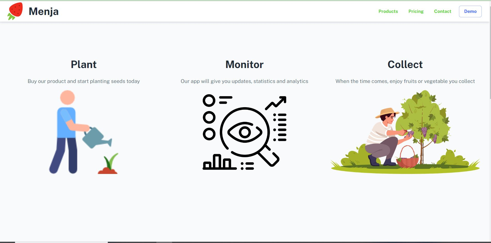
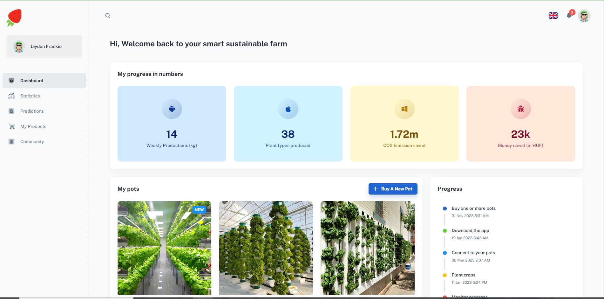

# [Demo](https://menjateam.netlify.app/)

# Menja Team | Hackathon project




## Introduction
This web application is my team's solution  in [MOME Social Impact Hackathon](https://mome.hu/en/social-impact-hackathon). 

## Solution
The designed solution is a platform that makes hydroponics technology for farming vegetables easy and accessible for cities citizens, so we can maximize the production, use the spaces efficiently, and make the most needed veggies accessible for the citizens and with low costs. 

## Mission
Our mission is to give you full control over your food. We are here to help you growing your own fruits and vegetables. Now you can choose to decide, plant, monitor and eat the products you grow.


## Technical details
The Take Off project is a React application that allows users to manage their data/assets more intuitively through a cutting edge management platform.

The application is built using React, Redux, and React Router. The application is built using the following technologies:

- React
- Redux
- React Router
- React Bootstrap
- React Toastify
- Material UI

## Installation

To install the application, run the following commands:

```bash
git clone https://github.com/BenAyedMehdi/Menja
cd takeoff
npm install
```

## Running the application

To run the application, run the following command:

```bash
npm start
```

## Building the application

To build the application, run the following command:

```bash
npm run build
```

## Deployment

The application is deployed on Netlify.

## License

This project is licensed under the MIT License - see the [LICENSE.md](LICENSE) file for details


- [**Mahdi Ben Ayed**](https://github.com/BenAyedMehdi)
